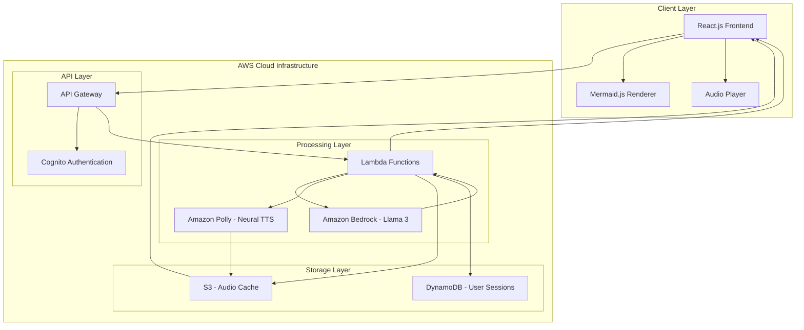

# Design Document: Drishya-Code

## Overview

Drishya-Code is an AI-powered educational platform that transforms complex programming code into interactive visual flowcharts with vernacular language explanations. The system leverages AWS cloud services to provide real-time code analysis, visualization, and multilingual tutoring capabilities optimized for students in Tier-2 and Tier-3 cities in India.

The platform addresses the "syntax trap" problem by focusing on logic comprehension rather than syntax memorization, using culturally relevant explanations in Hindi, Hinglish, and Marathi languages.

## Architecture

### High-Level Architecture



### Component Architecture

The system follows a microservices architecture with the following key components:

1. **Frontend Application**: React.js SPA hosted on AWS Amplify
2. **API Gateway**: RESTful API endpoints with rate limiting and authentication
3. **Code Analysis Service**: Lambda function for parsing and analyzing source code
4. **Visualization Service**: Lambda function for generating Mermaid.js flowchart syntax
5. **AI Tutor Service**: Lambda function integrating with Amazon Bedrock for explanations
6. **Audio Service**: Lambda function integrating with Amazon Polly for TTS
7. **Synchronization Service**: WebSocket-based service for real-time audio-visual sync

## Components and Interfaces

### 1. Code Analysis Engine

**Purpose**: Parse and analyze source code to extract logical flow and structure.

**Key Interfaces**:
```typescript
interface CodeAnalysisRequest {
  code: string;
  language: 'python' | 'java' | 'javascript' | 'cpp';
  userId: string;
}

interface CodeAnalysisResponse {
  ast: AbstractSyntaxTree;
  flowElements: FlowElement[];
  errors: CodeError[];
  complexity: ComplexityMetrics;
}

interface FlowElement {
  id: string;
  type: 'start' | 'process' | 'decision' | 'loop' | 'function' | 'end';
  content: string;
  codeLines: number[];
  children: string[];
  metadata: ElementMetadata;
}
```

**Implementation Strategy**:
- Use language-specific parsers (Python AST, Esprima for JavaScript, etc.)
- Transform AST into normalized flow representation
- Handle complex constructs like nested loops, exception handling, and async operations
- Maintain bidirectional mapping between code lines and flow elements

### 2. Visualization Generator

**Purpose**: Convert analyzed code flow into Mermaid.js flowchart syntax.

**Key Interfaces**:
```typescript
interface VisualizationRequest {
  flowElements: FlowElement[];
  preferences: VisualizationPreferences;
}

interface VisualizationResponse {
  mermaidSyntax: string;
  elementMapping: ElementMapping[];
  interactionPoints: InteractionPoint[];
}

interface VisualizationPreferences {
  theme: 'light' | 'dark' | 'cultural';
  complexity: 'simplified' | 'detailed';
  language: 'hindi' | 'hinglish' | 'marathi' | 'english';
}
```

**Mermaid Generation Strategy**:
- Map flow elements to appropriate Mermaid shapes (rectangles for processes, diamonds for decisions)
- Generate culturally appropriate node labels and colors
- Optimize layout for readability on various screen sizes
- Include metadata for interactive features

### 3. AI Tutor Service

**Purpose**: Generate contextual explanations using Amazon Bedrock Llama 3 model.

**Key Interfaces**:
```typescript
interface TutorRequest {
  flowElement: FlowElement;
  context: CodeContext;
  language: VernacularLanguage;
  explanationLevel: 'beginner' | 'intermediate' | 'advanced';
}

interface TutorResponse {
  explanation: string;
  culturalAnalogies: string[];
  keyTerms: TermDefinition[];
  followUpQuestions: string[];
}

interface CodeContext {
  surroundingElements: FlowElement[];
  programPurpose: string;
  userBackground: StudentProfile;
}
```

**Prompt Engineering Strategy**:
- Use culturally relevant examples (cricket scores, Bollywood references, Indian festivals)
- Adapt complexity based on student's learning level
- Include code-to-real-world analogies
- Generate explanations that connect to Indian educational context

### 4. Audio Synthesis Service

**Purpose**: Convert text explanations to natural-sounding speech using Amazon Polly.

**Key Interfaces**:
```typescript
interface AudioRequest {
  text: string;
  language: 'hindi' | 'hinglish' | 'marathi';
  voice: 'kajal' | 'aditi';
  speed: number;
  emphasis: EmphasisPoint[];
}

interface AudioResponse {
  audioUrl: string;
  duration: number;
  timingMarkers: TimingMarker[];
  cacheKey: string;
}

interface TimingMarker {
  word: string;
  startTime: number;
  endTime: number;
  elementId?: string;
}
```

**Audio Processing Strategy**:
- Use Amazon Polly's Kajal voice for Hindi/English bilingual support
- Implement SSML for proper pronunciation of technical terms
- Cache generated audio in S3 for performance
- Generate timing markers for synchronization

### 5. Synchronization Engine

**Purpose**: Coordinate audio playback with visual highlighting in real-time.

**Key Interfaces**:
```typescript
interface SyncRequest {
  audioUrl: string;
  timingMarkers: TimingMarker[];
  flowElements: FlowElement[];
}

interface SyncEvent {
  timestamp: number;
  action: 'highlight' | 'unhighlight' | 'focus';
  elementId: string;
  intensity: number;
}

interface SyncSession {
  sessionId: string;
  events: SyncEvent[];
  currentPosition: number;
  playbackRate: number;
}
```

**Synchronization Strategy**:
- Use WebSocket connections for real-time communication
- Implement client-side buffering for smooth playback
- Handle network latency compensation
- Support pause/resume and speed adjustment

### 6. Visual Debugger

**Purpose**: Highlight errors and issues directly in the flowchart visualization.

**Key Interfaces**:
```typescript
interface DebugRequest {
  code: string;
  language: string;
  flowElements: FlowElement[];
}

interface DebugResponse {
  errors: VisualError[];
  warnings: VisualWarning[];
  suggestions: CodeSuggestion[];
}

interface VisualError {
  elementId: string;
  type: 'syntax' | 'logic' | 'runtime';
  severity: 'error' | 'warning' | 'info';
  message: string;
  vernacularExplanation: string;
  visualIndicator: ErrorVisualization;
}
```

## Data Models

### Core Data Structures

```typescript
// User and Session Management
interface StudentProfile {
  userId: string;
  preferredLanguage: VernacularLanguage;
  learningLevel: 'beginner' | 'intermediate' | 'advanced';
  programmingExperience: string[];
  culturalContext: 'urban' | 'rural' | 'semi-urban';
  accessibilityNeeds: AccessibilityPreference[];
}

interface LearningSession {
  sessionId: string;
  userId: string;
  startTime: Date;
  codeSubmissions: CodeSubmission[];
  interactionHistory: UserInteraction[];
  learningProgress: ProgressMetrics;
}

// Code Analysis Models
interface AbstractSyntaxTree {
  language: string;
  rootNode: ASTNode;
  metadata: ASTMetadata;
}

interface ASTNode {
  type: string;
  value?: any;
  children: ASTNode[];
  position: SourcePosition;
  semanticInfo: SemanticInfo;
}

// Visualization Models
interface InteractiveFlowchart {
  mermaidSyntax: string;
  elements: InteractiveElement[];
  connections: FlowConnection[];
  metadata: ChartMetadata;
}

interface InteractiveElement {
  id: string;
  type: ElementType;
  position: Position;
  content: LocalizedContent;
  interactions: ElementInteraction[];
  codeMapping: CodeLineMapping;
}

// Audio and Synchronization Models
interface AudioTrack {
  trackId: string;
  language: VernacularLanguage;
  segments: AudioSegment[];
  totalDuration: number;
  syncMarkers: SyncMarker[];
}

interface AudioSegment {
  segmentId: string;
  text: string;
  audioUrl: string;
  startTime: number;
  endTime: number;
  associatedElements: string[];
}
```

### Database Schema (DynamoDB)

**Users Table**:
- Partition Key: userId (String)
- Attributes: profile, preferences, learningHistory, createdAt, lastActive

**Sessions Table**:
- Partition Key: sessionId (String)
- Sort Key: timestamp (Number)
- Attributes: userId, codeContent, interactions, progress, metadata

**Audio Cache Table**:
- Partition Key: contentHash (String)
- Attributes: audioUrl, language, voice, createdAt, accessCount, expiresAt

**Analytics Table**:
- Partition Key: date (String)
- Sort Key: userId#sessionId (String)
- Attributes: metrics, interactions, performance, errors

## Correctness Properties

*A property is a characteristic or behavior that should hold true across all valid executions of a system—essentially, a formal statement about what the system should do. Properties serve as the bridge between human-readable specifications and machine-verifiable correctness guarantees.*

Based on the requirements analysis, the following correctness properties ensure the system behaves correctly across all valid inputs and scenarios:

### Property 1: Code-to-Flowchart Generation Performance
*For any* valid source code in supported languages (Python, Java, JavaScript, C++) up to 200 lines, the Code_to_Graph_Engine should generate an interactive flowchart within 5 seconds.
**Validates: Requirements 1.1, 6.2**

### Property 2: Multi-Language Parsing Completeness  
*For any* valid source code in Python, Java, JavaScript, or C++, including advanced language constructs (list comprehensions, inheritance, async/await, pointers), the Code_to_Graph_Engine should successfully parse and generate a flowchart representation.
**Validates: Requirements 1.5, 9.1, 9.2, 9.3, 9.4, 9.5**

### Property 3: Control Flow Visualization Accuracy
*For any* code containing loops, conditionals, or function calls, the generated flowchart should correctly represent these structures with appropriate shapes (diamonds for decisions, distinct blocks for functions, clear entry/exit points for loops).
**Validates: Requirements 1.2, 1.3, 1.4**

### Property 4: Error Handling and Visualization
*For any* code containing syntax errors, logical errors, or undefined variables, the Visual_Debugger should highlight the problematic areas with appropriate visual indicators and provide explanations in the student's preferred vernacular language.
**Validates: Requirements 1.6, 3.1, 3.2, 3.3, 3.4, 3.5**

### Property 5: Vernacular Language Support
*For any* content requiring explanation or interaction, the system should provide accurate translations and culturally relevant explanations in Hindi, Hinglish, and Marathi languages.
**Validates: Requirements 2.1, 2.3, 2.5, 4.5**

### Property 6: Audio-Visual Synchronization Precision
*For any* audio explanation in Sync Mode, the Desi_Tutor should highlight corresponding flowchart elements within 100ms of mentioning them, maintaining synchronization during pause, replay, and speed adjustments.
**Validates: Requirements 2.2, 10.1, 10.2, 10.3, 10.4, 10.5**

### Property 7: Natural Voice Generation
*For any* text explanation, the Desi_Tutor should generate natural-sounding audio using appropriate Indian voices (Kajal, Aditi) that match the selected vernacular language.
**Validates: Requirements 2.4**

### Property 8: Interactive Quiz Generation
*For any* flowchart, Viva Mode should generate relevant questions that test program flow understanding (not syntax), provide immediate feedback, and offer progressive hints when students struggle.
**Validates: Requirements 4.1, 4.2, 4.3, 4.4**

### Property 9: Bidirectional Code-Diagram Linking
*For any* flowchart element or code line, clicking should highlight the corresponding counterpart, maintain synchronization during all interactions, and provide preview tooltips with accurate code snippets.
**Validates: Requirements 5.1, 5.2, 5.3, 5.4, 5.5**

### Property 10: Offline Capability Preservation
*For any* previously generated diagram and explanation, the system should provide access without network connectivity through proper caching mechanisms.
**Validates: Requirements 6.4**

### Property 11: Language Switching Consistency
*For any* active session, switching vernacular languages should immediately update all interface elements, explanations, and audio content to the selected language without data loss.
**Validates: Requirements 7.3**

### Property 12: Accessibility Support
*For any* common action in the platform, keyboard shortcuts should be available and functional to support students with motor disabilities.
**Validates: Requirements 7.5**

### Property 13: Data Security and Privacy
*For any* student data (code, personal information, session data), the system should encrypt it in transit and at rest, process code without permanent storage, and completely remove user data within 30 days of account deletion.
**Validates: Requirements 8.1, 8.2, 8.4**

## Error Handling

### Error Categories and Responses

**1. Code Analysis Errors**
- **Syntax Errors**: Return structured error information with line numbers and vernacular explanations
- **Unsupported Language Features**: Graceful degradation with partial visualization
- **File Size Limits**: Clear messaging about size constraints with suggestions for code splitting

**2. AI Service Errors**
- **Bedrock API Failures**: Fallback to cached explanations or simplified responses
- **Polly TTS Failures**: Fallback to text-only explanations with retry mechanisms
- **Rate Limiting**: Queue requests with user feedback about wait times

**3. Network and Performance Errors**
- **Slow Connections**: Progressive loading with offline fallbacks
- **Timeout Errors**: Partial results with option to retry specific components
- **Memory Constraints**: Automatic code simplification for resource-limited environments

**4. User Input Errors**
- **Invalid Code**: Constructive error messages with suggestions for fixes
- **Unsupported Languages**: Clear guidance on supported languages with examples
- **Empty Submissions**: Helpful prompts with sample code snippets

### Error Recovery Strategies

**Graceful Degradation**:
- If AI explanations fail, provide basic flowchart without narration
- If audio synthesis fails, display text explanations with visual emphasis
- If real-time sync fails, provide manual navigation controls

**Retry Mechanisms**:
- Exponential backoff for API failures
- User-initiated retry options for failed operations
- Background retry for non-critical features

**User Communication**:
- All error messages in student's preferred vernacular language
- Clear explanations of what went wrong and suggested next steps
- Progress indicators during retry attempts

## Testing Strategy

### Dual Testing Approach

The testing strategy employs both unit testing and property-based testing to ensure comprehensive coverage:

**Unit Tests**: Focus on specific examples, edge cases, and integration points between components. These tests validate concrete scenarios and catch specific bugs that might not be covered by property tests.

**Property Tests**: Verify universal properties across all inputs through randomized testing. These tests ensure the system behaves correctly for the vast space of possible inputs and catch edge cases that might not be anticipated in unit tests.

### Property-Based Testing Configuration

**Framework Selection**: 
- **Frontend (TypeScript)**: fast-check library for property-based testing
- **Backend (Node.js)**: fast-check for Lambda functions
- **Python Components**: Hypothesis for any Python-based analysis tools

**Test Configuration**:
- Minimum 100 iterations per property test to ensure statistical confidence
- Each property test must reference its corresponding design document property
- Tag format: **Feature: drishya-code, Property {number}: {property_text}**

**Property Test Implementation**:
- **Property 1**: Generate random valid code samples in all supported languages, verify response time < 5 seconds
- **Property 2**: Generate code with various language constructs, verify successful parsing and flowchart generation
- **Property 3**: Generate code with different control flow patterns, verify correct visual representation
- **Property 4**: Generate code with various error types, verify appropriate error visualization and vernacular explanations
- **Property 5**: Generate random content, verify accurate translation to all supported vernacular languages
- **Property 6**: Generate random audio explanations, verify synchronization timing within 100ms tolerance
- **Property 7**: Generate random text in vernacular languages, verify natural-sounding audio output
- **Property 8**: Generate random flowcharts, verify relevant quiz questions focus on logic understanding
- **Property 9**: Generate random flowcharts and code, verify bidirectional linking accuracy
- **Property 10**: Generate random diagrams, verify offline accessibility after caching
- **Property 11**: Generate random session states, verify language switching preserves all data
- **Property 12**: Generate random UI states, verify keyboard shortcuts functionality
- **Property 13**: Generate random user data, verify encryption, processing without storage, and deletion compliance

### Unit Testing Focus Areas

**Specific Examples**:
- Tutorial flow for first-time users (Requirements 7.2)
- Privacy policy visibility and clarity (Requirements 8.5)
- Cultural color and symbol usage in flowcharts
- Integration between AWS services (Bedrock, Polly, API Gateway)

**Edge Cases**:
- Maximum code file size (200 lines)
- Network timeout scenarios
- Concurrent user sessions
- Memory-constrained environments

**Error Conditions**:
- Malformed code inputs
- API service unavailability
- Invalid user authentication
- Corrupted cache data

### Integration Testing

**Service Integration**:
- End-to-end flow from code input to flowchart visualization
- Audio-visual synchronization across different network conditions
- Multi-language content consistency across all components

**Performance Testing**:
- Load testing with multiple concurrent users
- Memory usage profiling on low-end hardware
- Network bandwidth optimization validation

**Security Testing**:
- Data encryption verification
- Authentication and authorization flows
- Privacy compliance validation